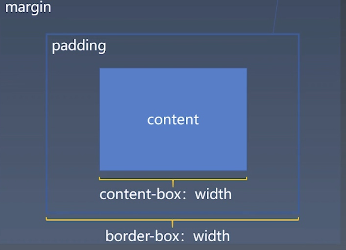

## 学习笔记

&nbsp;

BFC：

>　block container 可以容纳 BFC；

>　block-level box 可以放入 BFC；

>　block boxes overflow 的值是 visible，就和“父” BFC 合并。

如果一个元素具有 BFC，内部子元素再怎么翻江倒海、翻云覆雨，都不会影响外部的元素。所以，BFC 元素是不可能发生 margin 折叠的，因为 margin 折叠是会影响外部的元素的；BFC 元素也可以用来清除浮动的影响，因为如果不清除，子元素浮动则父元素高度塌陷，必然会影响后面元素布局和定位，这显然有违 BFC 元素的子元素不会影响外部元素的设定。

&nbsp;

盒模型：

&nbsp;

正常流：依次排列，排不下了换行
> 格式化上下文 + 盒 / 文字 = 位置

> formatting context + boxes/charater = positions

&nbsp;

vertical-align: 设置时，盒与文字混合排版

&nbsp;

* 当遇到块级盒：排入块级格式化上下文。
* 当遇到行内级盒或者文字：首先尝试排入行内级格式化上下文，如果排不下，那么创建一个行盒，先将行盒排版（行盒是块级，所以到第一种情况），行盒会创建一个行内级格式化上下文。
* 遇到 float 盒：把盒的顶部跟当前行内级上下文上边缘对齐，然后根据 float 的方向把盒的对应边缘对到块级格式化上下文的边缘，之后重排当前行盒。
